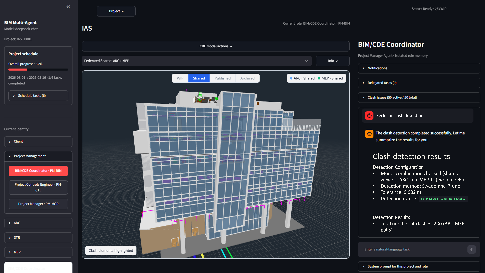

# BIM Multi-Agent IFC Collaboration Platform

An experimental multi-agent IFC collaboration platform for BIM AI security
research. A user-facing coordinator enforces user permissions and delegates IFC
work to isolated ARC, STR, and MEP specialist Agents.



## Current capabilities

- Current `ARC.ifc`, `STR.ifc`, and `MEP.ifc` files per project
- Optional `Cost.csv` and `Schedule.csv` with audited summary, query, and IFC mapping tools
- Isolated main conversations and task-specific specialist conversations
- Persistent Project Manager delegation to ARC, STR, and MEP Agents
- Structured task status, result, error, Agent, and target-file records
- Single-discipline and federated That Open Fragments views
- IFC selection context mapped back to GlobalId and STEP id
- Coordinator-only Cost/Schedule CSV tools and federated clash detection
- Specialist-only IFC MCP summary, selection, deep inspection, relations, and edit tools
- Isolated ifcMCP edit sessions with function documentation and audit; no function permission list
- World-coordinate AABB clash-candidate detection across uploaded discipline models
- Deduplicated clash Issues linked to remediation tasks
- Project-and-identity-specific editable system prompts
- Enforced user, delegation, and discipline boundaries with audit records
- Pytest coverage for storage, delegation, ifcMCP isolation, and CSV tools

## Setup

```bash
python3 -m venv .venv
source .venv/bin/activate
pip install -r requirements.txt
cp .env.example .env
```

Run the automated checks:

```bash
pytest -q
```

Set `DEEPSEEK_API_KEY` in `.env`, then build the Viewer:

```bash
cd viewer
npm install
npm run build
cd ..
```

Run the platform:

```bash
streamlit run app.py
```

Project management and Viewer features remain usable without a model API key.

## Research boundary

The application keeps fixed user routing and Viewer model scope. The coordinator
cannot directly query or edit a single IFC model. Discipline and user permissions
are enforced before delegation and again at the specialist tool boundary; denied
attempts are written to `audit_events`. This remains an experimental system.
